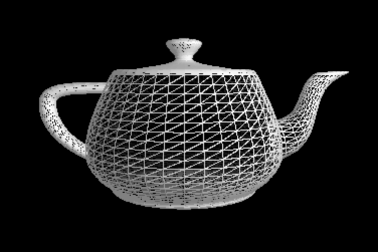
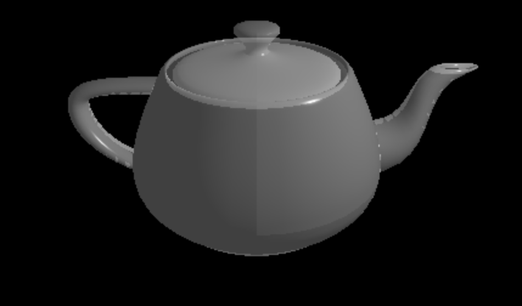
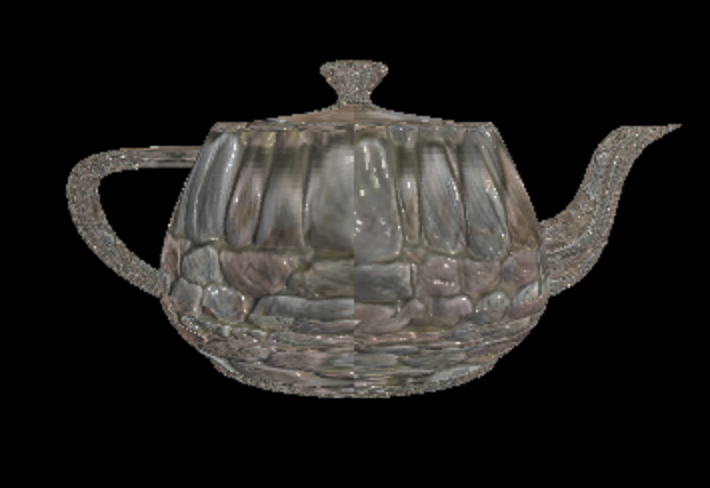
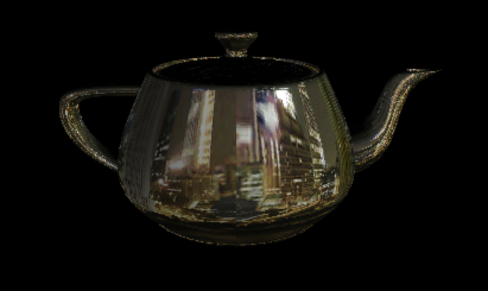
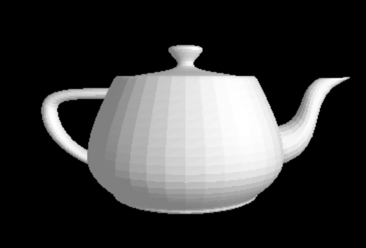
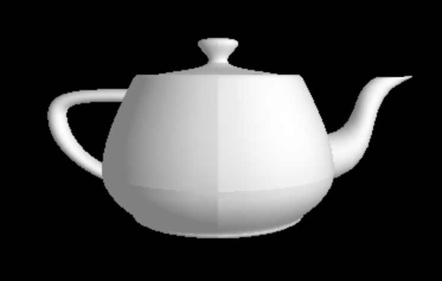
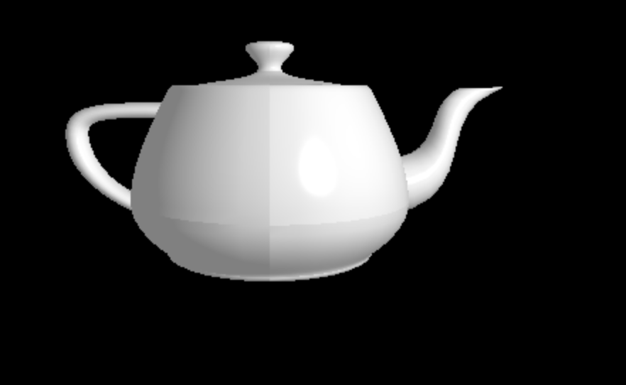
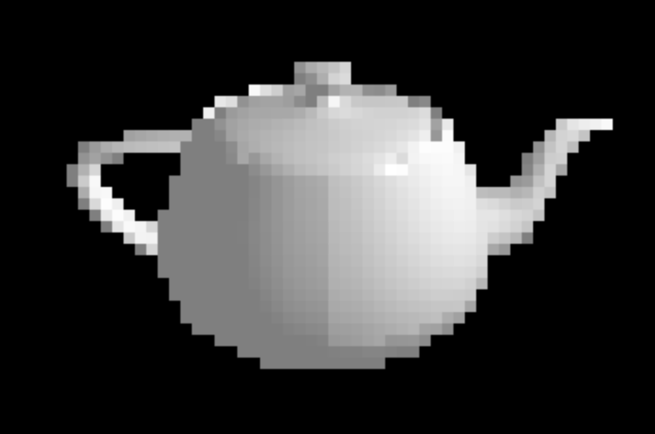
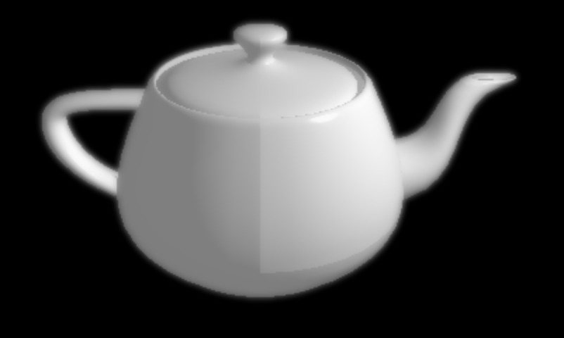

# 3D Graphics Software Renderer
## My Summer 2019 Software Engineering Internship Project at AMD

---

**Utilized**: C programming, 3D graphics algorithms

A simplified version of a 3D graphics API like OpenGL, with some 3D modeling application functionalities. Designed and built during my summer internship at AMD under the mentorship of Mac 3D Graphics Driver Director Chris Bentley.

---

## Different Program Modes and How to Run Them
To avoid code duplication while separating features with different core functionalities, I created three main program modes: BASIC, SCENE, and IMAGE PROCESSING mode.

To `make` things easier (no pun intended), I included a make-file in the top-level directory.\
Unfortunately, I have only gotten the program to compile and run properly on Mac OS machines, but I hope to extend the program to different platforms in the future.

After you `cd` into the `3d-renderer` directory:

### BASIC mode:
Use to test 3D rendering techniques on a single object at a time.\
`make run-basic` 

### SCENE mode:
Use to test 3D rendering techniques and modeling application features on multi-object scenes.\
`make run-scene file="scenes/<file-name">` 

### IMAGE PROCESSING mode:
Use to run various image processing algorithms on an image.\
`make run-image` 

---

## Implemented Features
### Basic Features
* frame and filled triangle modes
* alpha blending
* depth testing
* texture mapping
* cube mapping
* bump mapping
* frustum culling
* triangle clipping

### Rendering Optimizations
* deferred rendering
* backface culling

### Additional Visual Effects
* fog
* depth of field
* post processing

### 3D Modeling Features
* scene files
* mouse IO
* object manipulators
* visible axes and bounding boxes for editing
* camera movement 

## Some Screenshots

**Teapot frame** 

**Teapot with alpha blending enabled**

## Texture Mapping
\
**Bump mapping**

\
**Cube mapping**

## Shading
\
**Flat shading**

\
**Phong shading**

\
**Phong shading with specular highlights**

## Post Processing
\
**Pixelation ("Lincoln") image processing effect**

\
**Depth of field post processing**

---

## TODO:
- [ ] Prune the OpenGL functionalities used to merge 3D software rendering with OpenGL calls.
- [ ] Add high level descriptions of the different techniques implemented
- [ ] Recap on lessons learned
- [ ] Make program cross-platform
