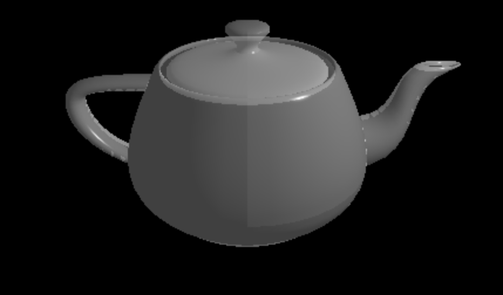
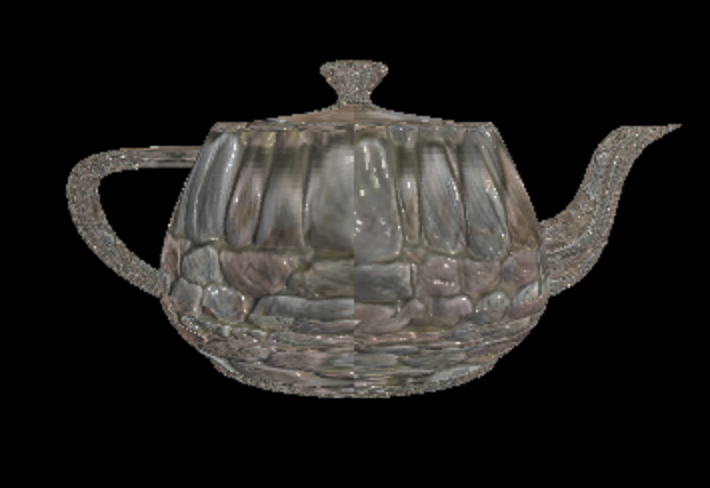
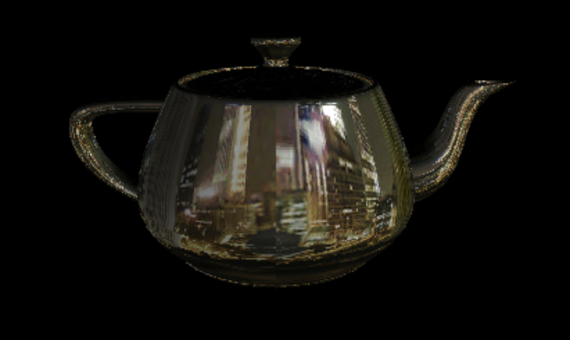
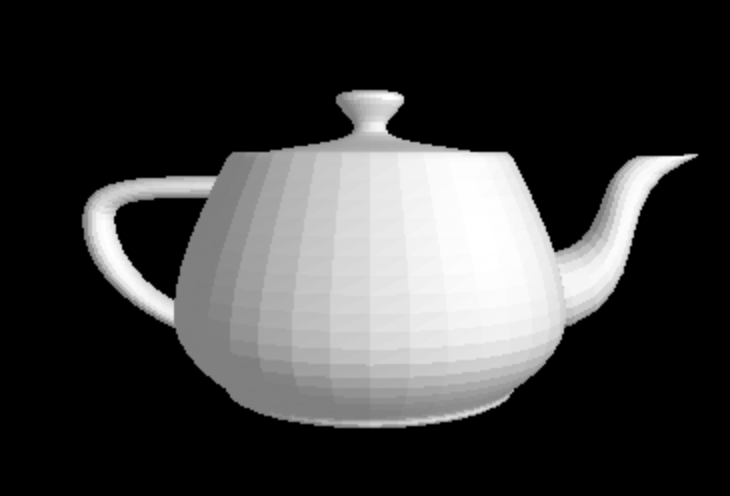
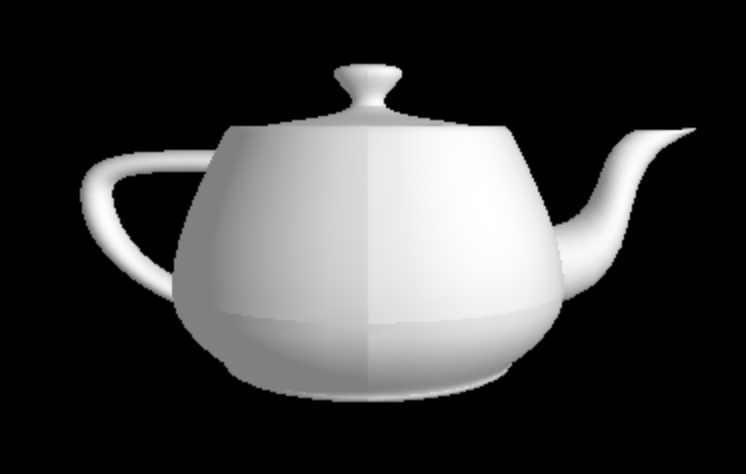
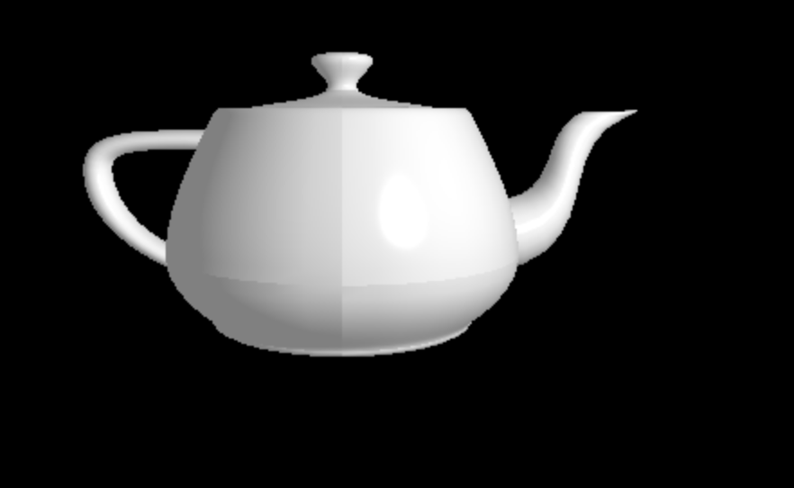
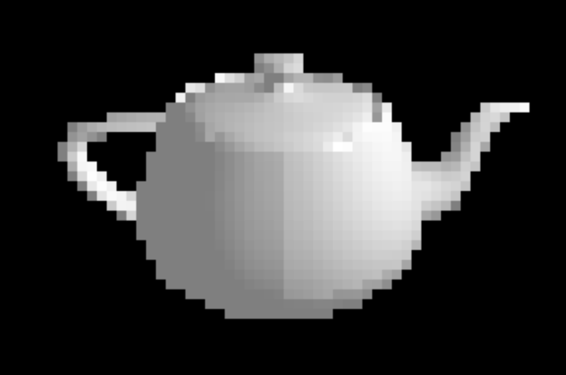
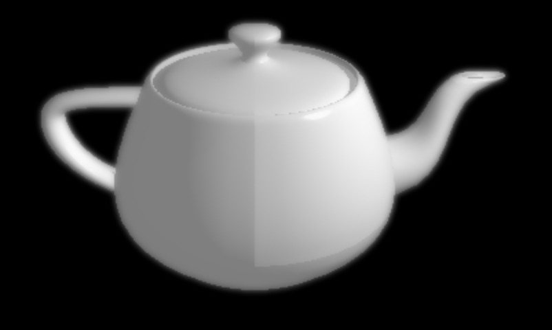

# graphics
Software Renderer in C
 
~ building up to a simplified version of a 3D graphics API like OpenGL

Graphics Features
* frame and filled triangle modes
* alpha blending
* depth testing
* cube mapping
* bump mapping

## Texturing 

## Shading

## Post Processing

